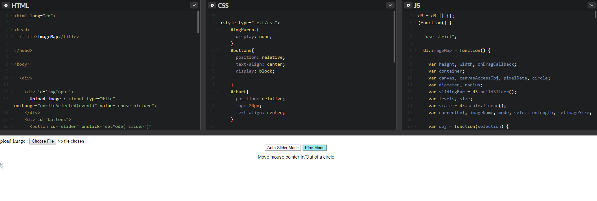

# Entry 4

## Update

Since the previous entry I have continued studying the code from the circle image project, while also studying another
example of d3. This example is much more simple and only uses one file unlike the image circle map and is way less
complicated.

## The second example

This small d3 porject is pretty simple and easier to understand than image circle.
While its css has some unfamiliar names and uses, the script inside reamins essentiallty very short and easy to read
However, I tried running it on c9, but it would not work, because I had placed it inside of a html file and would only show a dark gray background, after placing it in the
html file and also trying repl.it it still would not run, so I started looking through the internet to see if I was the only one, I was not, some users have been running
into this problem, one said they couldn't run it on Chrome so i decided to run it on internet explorer as that
was the only other internet browser installed on my computer at the time, it did not work on it either but it can still be seen
through this [link](http://bl.ocks.org/metormote/6392996)as well as what the end result should look like:

and the code is still relatively simple, it is the css that confuses me however
since most of it we have not worked with.

## Update
As of now I have found a perfect sandbox in which i can use d3.js at its current version without having to installed
any new program onto the computer nor onto the c9 workspace, which has proved to be rather troublesome in updating it to the
current d3 software and can finally tinker with the code and see what results have changed, not only that it neatly
seperates the html, the CSS and d3. Here is a screenshot of the beginning:

Although I'm still working out the reason why the image does not load in, I will be further tweaking it, such as changing the dimensions of the shapes and possibly adding
multiple images to make
## Takeaways
 * Always throughly check if an example chunk of code will work on c9 or anywhere else before putting time into it
 * Search for backup plans in case your current project does not pan out