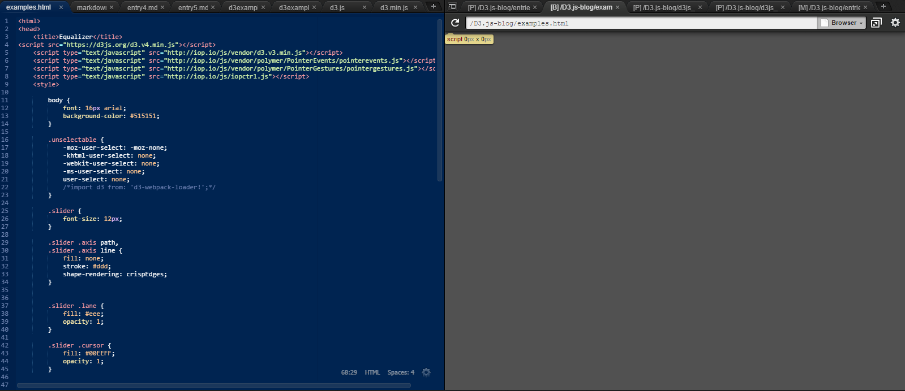
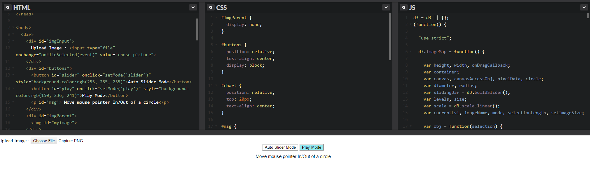

# Entry 5

## Big Trouble in Little Sandbox Town:
 While I have found a sandbox that supports d3, I believe that there are others that can run my project better
 than what codepen can since codepen can run my program and allow me to upload images but it will not 
 present them in circle form, which is the only problem preventing me from tweaking other issues that
 are for show. While I will stay on codepen for now I am also continuing my search for a d3 sandbox that
 will properly work since I know the code in all sections are correct as no errors other than these:
 
 
 
 However, despite these setbacks I will continue to work on codepen and if I do find a better sandbox, I will carry
 over my progress and use it there, since I have made major progress since mvoing from the hassel of installing the 
 correct format and install commands on c9 to properly install d3 onto the c9 workspace, there's also issues in the c9 forums
 but very little information on how to properly install it there. Some exampleso 0f my progress since beginning:
 
 Beginning
 
  
  Middle:
  
  
  Aimed End Goal:
  
  
  Eventually I will find the issue and fix it so I can begin adding small stuff to it, but those can wait for now.
  
  ## Takeaway:
  
  I guess one big takeaway I got through my rpoblem searching for thie issue is to always explore other options just in case
  because I spent my first few weeks messing with c9 trying to install it whne i could have simply googled another IDE
  and contniued my project and saved myself the trouble. Now I have double, and triple, checked my code for any errors and there aren't any that I am aware of
  I will search for other sandboxes that can properly show it, until then I will ask my friends and teacher for help in resolving this issue.