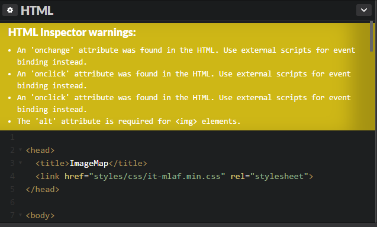

# The Final Countdown 

## Update:
 Today marks the final 3 weeks of our independent study and our process of finalizing our projects
 to show off what we can do with what we learned on our own after these 9 weeks. While most of my project 
 is complete and functional, by that I mean i can load any image I choose, however it will not load them as
 circles, which is the main problem at the moment and the last piece of the puzzle I have to find in order
 to fully be able to present this as a unique project, and not just as a way to upload a photo onto a screen.
 Through my progress I have fixed several issues but one still remains, and I do not know if it is the cause of
 my project not working, each time I analyze the HTML section of the code it props up several of these problems
 
 
 Now I have searched through google and the solutions I have found involve somewhat more complicated ways of 
 resolving it, something I am going to ask for help in class from my fellow classmates and see if I can quickly resolve this issue 
 before the few weeks left on this project are up. If you wish to actively use my codepen project then just simply
 click the link [here](https://codepen.io/luism6058/pen/gWwOvj).
 
 ## Takeaways
  In terms of take aways there isn't much to say other than to turn for help when you can't figure something out.
 Better yet, explaining step by step what your code does to someone, or anything, really has helped me code out someone
bugs I have encountered while tweaking my project, and it helps a ton. Instead of sitting there and thinking on what 
should work I spoke with my brother, mom or dad, whoever was really not busy and had spare time or I spoke it aloud to my 
Star Wars figureine.
